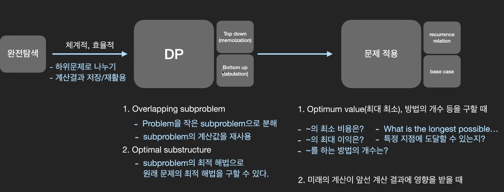

### 1. DP

- DP(Dynamic Programming): 문제에 대한 정답이 될 가능성이 있는 모든 해결책을 '체계적'이고 '효율적'으로 탐색하는 풀이법

1. Top down(memoization)

- 재귀 사용 -> 구현시간이 빠르다.
- 재귀풀이에서 중복되는 계산값을 저장하여(memoize) 동일한 함수 호출시에 재활용 한다.
- hashtable 또는 list에 계산 결과를 저장한다.

2. Bottom up(tabulation)

- 반복문 사용 -> 실행시간이 빠르다.
- 더 작은 subproblem에 대한 계산결과를 DP table에 저장하여 더 큰 문제의 계산에 활용한다.
- hashtable 또는 list에 계산 결과를 저장한다.

### 2. 총 정리

1. DP: 다이나믹 프로그래밍이란 크고 복잡한 문제를 작게 나누고, 중복되는 문제라면 한 번 계산한 결과값을 저장해놓고 재사용함으로써 문제를 효율적으로 해결하는 알고리즘

2. 문제 풀이: 특정한 문제를 완전 탐색 알고리즘으로 접근해보고, 시간복잡도가 너무 높다면 DP를 적용할 수 있는지 생각해보자.  subproblem의 중복 여부를 판단하는 것이 첫 번째 순서다.

3. 구현 방법

- 일단 재귀함수로 비효율적인 완탐 코드를 작성한다.
- 중복되는 subproblem의 계산 결과를 저장(memoize)한다.
- 탑다운(재귀) -> 바텀업(반복문)으로 코드 전환을 고려한다.

4. 코테 출제: DP는 문제에 적용하기에 어려운 개념이라서 코테에는 기본에 충실한 문제 위주로 출제할 수 밖에 없다.
