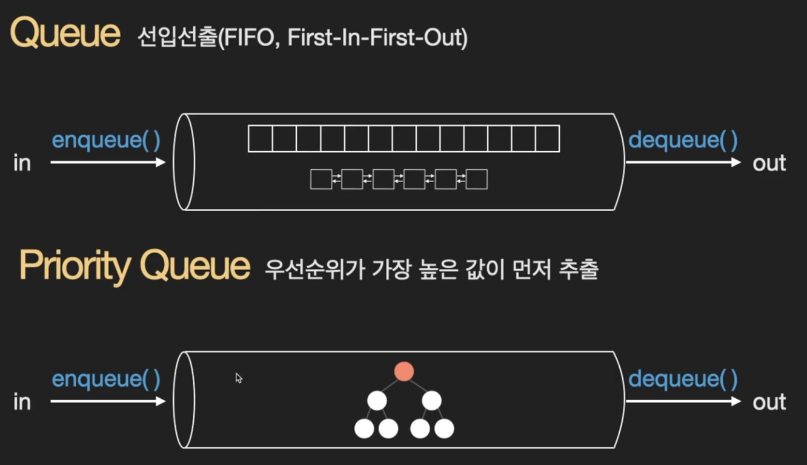
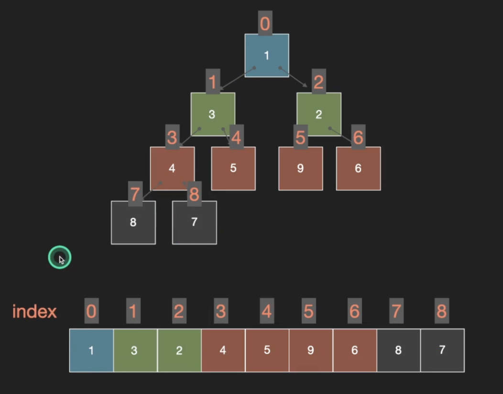
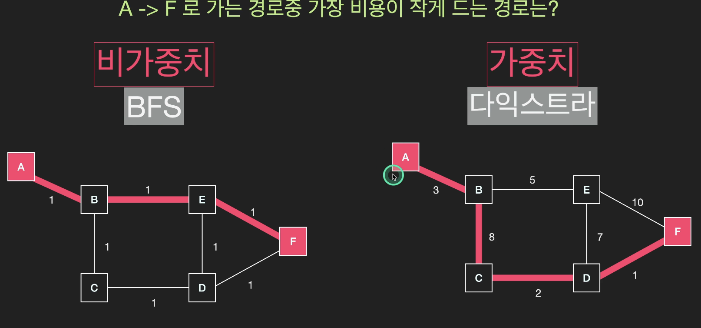

### 1. 우선 순위 큐



- Priority Queue(우선순위 큐): 가장 높은 우선순위를 가진 데이터가 큐에서 먼저 추출되는 자료 구조
- 힙 자료구조로 구현

- 구현 방법

1. 배열 리스트

- enqueue: O(1)
- dequeue: O(n)

2. 배열 리스트

- enqueue: 정렬 O(nlogn)
- dequeue: O(1)

3. 완전 이진 트리 -> 젤 효율적

- enqueue: 우선 순위가 높은 노드를 root 노드로 보냄 -> 높이만큼 스왑 -> 높이는 O(logn)
- dequeue: root 노드를 제거하고 마지막 노드로 교체 + 우선 순위 높은걸로 스왑 -> O(logn)

### 2. Heap 구현

- Heap(힙): 완전 이진 트리 형태의 자료구조이다.
- min heap: 부모 노드의 값이 자식 노드의 값보다 작은 트리 형태의 자료구조
- max heap: 부모 노드의 값이 자식 노드의 값보다 큰 트리 형태의 자료구조
- 형제 노드 간에는 대소 관계가 정해지지 않는다.
- Root 노드가 가장 큰(작은) 값을 갖는다.

- 완전 이진 트리의 특성
- 리스트로도 구현이 가능하다
- 부모 i => left child: 2*i+1, right child: 2*i+2



- 5, 3, 9, 4, 1, 2, 6
- min heap: 1, 3, 2, 4, 5, 9, 6
- max heap: 9, 4, 6, 3, 1, 2, 5

- 다익스트라 -> 우선 순위 큐 자료구조 사용 -> 힙으로 구현

### 3. 최대힙 템플릿

```ts
class MaxHeap {
  constructor() {
    this.heap = [];
  }

  getLeftChildIndex(parentIndex) {
    return 2 * parentIndex + 1;
  }

  getRightChildIndex(parentIndex) {
    return 2 * parentIndex + 2;
  }

  getParentIndex(childIndex) {
    return Math.floor((childIndex - 1) / 2);
  }

  swap(index1, index2) {
    [this.heap[index1], this.heap[index2]] = [
      this.heap[index2],
      this.heap[index1],
    ];
  }

  peek() {
    return this.heap[0];
  }

  insert(value) {
    this.heap.push(value);
    this.heapifyUp();
  }

  heapifyUp() {
    let currentIndex = this.heap.length - 1;
    while (currentIndex > 0) {
      const parentIndex = this.getParentIndex(currentIndex);
      if (this.heap[parentIndex] < this.heap[currentIndex]) {
        this.swap(parentIndex, currentIndex);
        currentIndex = parentIndex;
      } else {
        break;
      }
    }
  }

  remove() {
    if (this.heap.length === 1) return this.heap.pop();
    const removedValue = this.heap[0];
    this.heap[0] = this.heap.pop();
    this.heapifyDown();
    return removedValue;
  }

  heapifyDown() {
    let currentIndex = 0;
    while (this.getLeftChildIndex(currentIndex) < this.heap.length) {
      const leftChildIndex = this.getLeftChildIndex(currentIndex);
      const rightChildIndex = this.getRightChildIndex(currentIndex);
      const largerChildIndex =
        rightChildIndex < this.heap.length &&
        this.heap[rightChildIndex] > this.heap[leftChildIndex]
          ? rightChildIndex
          : leftChildIndex;
      if (this.heap[currentIndex] < this.heap[largerChildIndex]) {
        this.swap(currentIndex, largerChildIndex);
        currentIndex = largerChildIndex;
      } else {
        break;
      }
    }
  }
}

// 5, 3, 9, 4, 1, 2, 6
const max_heap = new MaxHeap();
const arr = [45, 36, 54, 27, 63];
arr.forEach((v) => max_heap.insert(v));
console.log(max_heap.heap); // max heap: [ 63, 54, 45, 27, 36 ]
```

### 4. 최소힙 템플릿

```ts
class MinHeap {
  constructor() {
    this.heap = [];
  }

  getLeftChildIndex(parentIndex) {
    return 2 * parentIndex + 1;
  }

  getRightChildIndex(parentIndex) {
    return 2 * parentIndex + 2;
  }

  getParentIndex(childIndex) {
    return Math.floor((childIndex - 1) / 2);
  }

  swap(index1, index2) {
    [this.heap[index1], this.heap[index2]] = [
      this.heap[index2],
      this.heap[index1],
    ];
  }

  peek() {
    return this.heap[0];
  }

  insert(value) {
    this.heap.push(value);
    this.heapifyUp();
  }

  heapifyUp() {
    let currentIndex = this.heap.length - 1;
    while (currentIndex > 0) {
      const parentIndex = this.getParentIndex(currentIndex);
      if (this.heap[parentIndex] > this.heap[currentIndex]) {
        this.swap(parentIndex, currentIndex);
        currentIndex = parentIndex;
      } else {
        break;
      }
    }
  }

  remove() {
    if (this.heap.length === 1) return this.heap.pop();
    const removedValue = this.heap[0];
    this.heap[0] = this.heap.pop();
    this.heapifyDown();
    return removedValue;
  }

  heapifyDown() {
    let currentIndex = 0;
    while (this.getLeftChildIndex(currentIndex) < this.heap.length) {
      const leftChildIndex = this.getLeftChildIndex(currentIndex);
      const rightChildIndex = this.getRightChildIndex(currentIndex);
      const smallerChildIndex =
        rightChildIndex < this.heap.length &&
        this.heap[rightChildIndex] < this.heap[leftChildIndex]
          ? rightChildIndex
          : leftChildIndex;
      if (this.heap[currentIndex] > this.heap[smallerChildIndex]) {
        this.swap(currentIndex, smallerChildIndex);
        currentIndex = smallerChildIndex;
      } else {
        break;
      }
    }
  }
}

const min_heap = new MinHeap();
const arr = [45, 36, 54, 27, 63];
arr.forEach((v) => min_heap.insert(v));
console.log(min_heap.heap); // min heap: [ 27, 36, 54, 45, 63 ]
```

### 5. Dijkstra(다익스트라)



- 다익스트라: 가중치 그래프에서 시작점과 도착점이 주어졌을 때, 최단 경로를 반환하는 알고리즘이다.
- 가중치 그래프
- 방문 할 수 있는 노드 중에 가장 비용이 작은 곳 방문(우선순위가 높은 곳 방문)

- 우선순위 큐 간단 구현

```ts
class PriorityQueue {
  constructor() {
    this.values = [];
  }
  enqueue(val, priority) {
    this.values.push({ val, priority });
    this.sort();
  }
  dequeue() {
    return this.values.pop();
  }
  sort() {
    this.values.sort((a, b) => b.priority - a.priority);
  }
}
```

- 구현

1. 우선순위 큐에 시작 노드 추가
2. 우선 순위가 가장 높은 노드 추출
3. 방문 여부 확인
4. 비용 업데이트
5. 현재 노드와 연결된 노드 우선순위 큐에 추가 -> 우선 순위가 높은 노드가 앞에 온다.
6. 2~5 반복
7. 목적지에 기록된 비용 반환

```ts
function networkDelayTime(times, n, k) {
  const graph = Array.from({ length: n + 1 }, () => []);
  times.forEach((element) => {
    const [u, v, w] = element;
    graph[u].push([v, w]);
  });

  // 2. 다익스트라 알고리즘
  const costs = Array.from({ length: n + 1 }, () => undefined);
  const pq = [[k, 0]];
  while (pq.length) {
    const [cur_v, cur_cost] = pq.pop();
    if (costs[cur_v] === undefined) {
      costs[cur_v] = cur_cost;
      graph[cur_v].forEach((element) => {
        const [next_v, cost] = element;
        const next_cost = cur_cost + cost;
        pq.push([next_v, next_cost]);
      });
      // 내림차순 정렬
      pq.sort((a, b) => b[1] - a[1]);
    }
  }

  costs.shift();
  // 3. 방문 못한 노드 찾기
  const flag = costs.every((cur) => {
    return cur !== undefined;
  });
  // 4. 최소값 중에서 최대값 구하기
  if (flag) {
    return Math.max(...costs);
  } else {
    return -1;
  }
}
```
