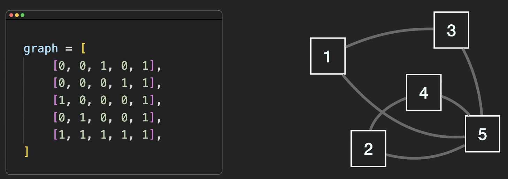
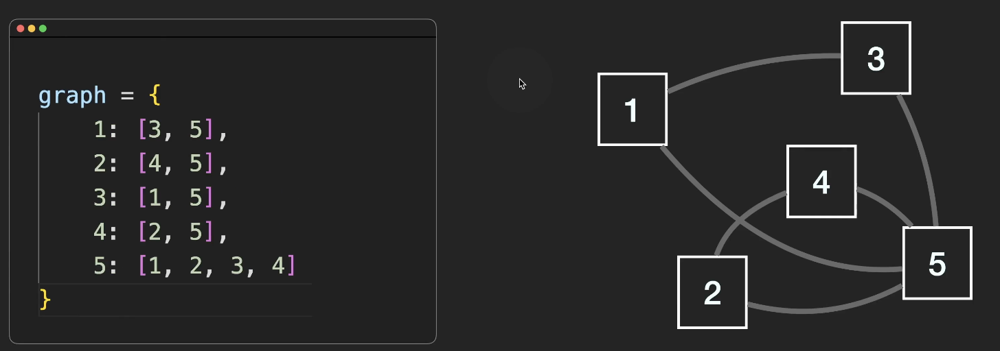
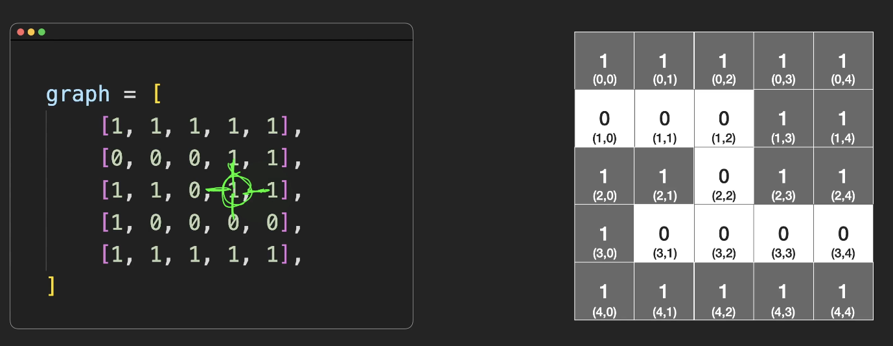
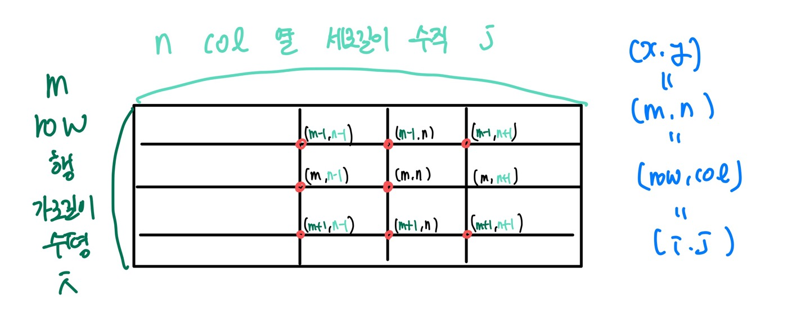

### 1. Graph

- 그래프 G(V,E): 어떤 자료나 개념을 표현하는 정점(vector)들의 집합 V와 이들을 연결하는 간선(edge)들의 집합 E로 구성된 자료구조

- 그래프 종류

1. 방향 그래프 vs 무향 그래프(=양방향, 코테에 가장 많이 등장)
2. 다중 그래프 vs 단순 그래프
3. 가중치 그래프 -> 다익스트라
   -> 무향 그래프, 단순 그래프, 가중치 그래프

### 2. 코테 적용

- Graph 활용

  > 1.  Graph 구현
  > 2.  DFS 깊이 우선 탐색
  > 3.  BFS 너비 우선 탐색

- DFS, BFS 모두 완탐이 가능하다.

- 그래프 예시

  > 1. 현실 세계의 사물이나 추상적인 개념 간의 연결 관계를 표현한다.<br>
  > 2. 그래프는 현실의 문제를 해결하기 위한 도구로써 유용하게 이용된다. -> 문제가 많이 나온다.<br>
  >    ex1) 도시들을 연결하는 도로망: 도시(vertex=node), 도로망(edge)<br>
  >    ex2) 지하철 연결 노선도: 정거장(vertex), 도로망(edge)<br>
  >    ex3) 컴퓨터 네트워크: 각 컴퓨터와 라우터(vertex), 라우터 간의 연결 관계(edge)<br>
  >    ex4) 소셜 네트워크 분석: 페이스북의 계정(vertex), follow 관계(edge)

- Graph 구현 방법

1. 인접 행렬
2. 인접 리스트 -> 주로 사용
3. 암시적 그래프 -> 주로 사용<br>

- 인접 행렬: 이중 리스트 사용, 대각선이 0이다, 대칭이 됨
  메모리 낭비가 심함 -> 안쓰는 0까지 메모



- 인접 리스트



- 암시적 그래프: 상하좌우로 연결

  

    

### 3. BFS(Breadth-first search) 너비 우선 탐색 템플릿

- 나머지는 Graph 예제로 확인

```ts
function bfs(graph, start) {
  // 방문
  const visited = {};
  // 예약
  const queue = [start];
  visited[start] = true;

  while (queue.length) {
    // 꺼냄
    const cur = queue.shift();
    // 꺼낸 거랑 연결되어 있는거 확인
    graph[cur].forEach((element) => {
      if (!visited.hasOwnProperty(element)) {
        queue.push(element);
        visited[element] = true;
      }
    });
  }
  return visited;
}

const graph = {
  0: [1, 3, 6],
  1: [0, 3],
  2: [3],
  3: [0, 1, 2, 7],
  4: [5],
  5: [4, 6, 7],
  6: [0, 5],
  7: [3, 5],
};

let start = 0;

console.log(bfs(graph, start));
// 0 ,1 ,3, 6, 2, 7, 5, 4
```

### 4. 암시적 그래프 BFS 템플릿

```ts
function bfs(grid, sx, sy) {
  const row = grid.length; // row = x = i = m = 가로길이
  const col = grid[0].length; // col = y = j = n = 세로길이
  const dir [[-1,0],[1,0],[0,-1],[0,1]];

  function isValid(x, y) {
    return x >= 0 && x < row && y >= 0 && c < col && grid[x][y] === 1;
  }
  const visited = Array.from({ length: row }, () => Array(col).fill(false));
  const q = [[sx,sy]];
  visited[sx][sy] = true;
  while (q.length) {
    const [curX, curY] = q.shift();
    dir.forEach((d) => {
      const nx = curX + d[0];
      const ny = curY + d[1];
      if (isValid(nx, ny)) {
        if (!visited[nx][ny]) {
          visited[nx][ny] = true;
          q.push([nx, ny]);
        }
      }
    })
  }
  return;
}
```

### 5. DFS(Depth-first search) 깊이 우선 탐색 템플릿

```ts
function solution(graph, start) {
  const visited = {};
  visited[start] = true;
  dfs(graph, visited, start);
  return visited;
}

function dfs(graph, visited, cur) {
  visited[cur] = true;
  graph[cur].forEach((element) => {
    if (!visited.hasOwnProperty(element)) {
      dfs(graph, visited, element); // 연결되어 있는 애들한테 dfs 위임
    }
  });
}
```

### 6. 암시적 그래프 DFS 템플릿

```ts
function solution(grid) {
  const row = grid.length; // row = x = i = m = 가로길이
  const col = grid[0].length; // col = y = j = n = 세로길이
  const dir = [
    [-1, 0],
    [1, 0],
    [0, -1],
    [0, 1],
  ];
  const visited = Array.from({ length: row }, () => Array(col).fill(false));

  function isValid(x, y) {
    // "1 type is String"
    return x >= 0 && x < row && y >= 0 && y < col && grid[x][y] === 1;
  }

  function dfs(sx, sy) {
    visited[sx][sy] = true;
    dir.forEach((d) => {
      const nx = sx + d[0];
      const ny = sy + d[1];
      if (isValid(nx, ny)) {
        if (!visited[nx][ny]) {
          dfs(nx, ny);
        }
      }
    });
    return;
  }

  dfs(0, 0);
  return;
}
```
