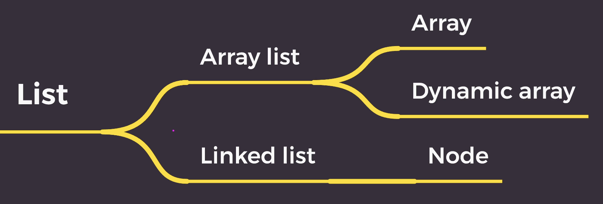

### 1. List



- Array list: 연속적, 배열 기반
- Linked list: 비연속적, 노드 기반

### 2. Array list

### 2-1. Array

1. 고정된 저장 공간(fixed-size)
2. 순차적인 데이터 저장(order)

- 메모리에 저장된 데이터에 접근하려면 주소값을 알아야 함<br>
- 배열 변수는 자신이 할당받은 메모리의 첫번째 주소값을 가리킴<br>
- 따라서 첫 주소값만 안다면 어떤 인덱스든 접근 가능 => direct access, random access<br>
- 즉 O(1)의 시간복잡도를 가짐

### 2-2. Dynamic Array

- 정적 배열과 다르게 size를 늘릴 수 있다.<br>
- resize: size를 2배 늘린 배열을 새로 선언(Doubling) -> 기존 데이터를 옮김 O(n) -> 데이터 추가 -> 기존건 삭제(free)

```
O(1) - push, pop

O(n) - unshift, shift, slice, splice, forEach, map, filter, reduce, indexOf, lastIndexOf, includes, reverse, join, fill, find, findIndex, every, some

O(m: 두 배열의 길이의 합) - concat

O(nlogn) - sort
```

### 2-3. 코테 적용 (반복문, two-pointer)

- 배열의 다양한 활용
  > 1. 반복문
  > 2. Sort & Two Pointer<br>

### 2-4. 코드

1. 반복문

```ts
// 반복문
function twoSum(nums, target) {
  for (let i = 0; i < nums.length; i++) {
    for (let j = i + 1; j < nums.length; j++) {
      if (nums[i] + nums[j] === target) {
        return 'True';
      }
    }
  }
  return 'False';
}

twoSum([4, 1, 9, 7, 5, 3, 18], 14);
```

2. two-pointer

- 정렬: O(nlogn)
- two-pointer: 두 개의 포인터를 가지고 문제를 해결하는 방법, 보통 정렬이 된 상황에서 쓰임
- 자료구조와 알고리즘 활용해보기
  배열 -> 정렬을 해볼까? -> 시간 복잡도가.. O(nlog)이네 -> ok 한 번 해보자
- 두 숫자를 더해서 14여야 하는데 작으면 오른쪽으로, 크면 왼쪽으로 이동시키자

```ts
// 투포인터 -> O(nlogn)
function twoSumTwoPointer(nums, target) {
  nums.sort((a, b) => a - b); // O(nlogn)
  let left = 0;
  let right = nums.length - 1;
  // O(n)
  while (left < right) {
    if (nums[left] + nums[right] < target) {
      left++;
    } else if (nums[left] + nums[right] > target) {
      right--;
    } else {
      return 'True';
    }
  }
  return 'False';
}

console.log(twoSumTwoPointer([4, 1, 9, 7, 5, 3, 18], 14));
```

### 3. Linked list

- Node라는 구조체가 연결되는 형식을 데이터를 저장하는 자료구조
- Node는 데이터 값과 node의 주소값을 저장
- 메모리상에서는 비연속적으로 저장이 되어있지만, 각 node가 next node의 메모리 주소값을 가리킴으로써 논리적인 연속성을 갖게됨
- node를 이용해서 구현

### 3-1. 코테 적용

- Linked List의 다양한 활용

  > Linked List 자유자재로 구현 -> 선형 자료구조 + 중간에 데이터 추가/삭제 용이\
  > Tree or Graph에 활용

- 문제 이해하기 (step1)

```
1. input, output 확인
- input 값의 특징 (정수인가? 값의 크기의 범위는? 마이너스도 가능한가? 소수인가? 자료형은 문자열인가? 등등)
- output값의 특징 (내가 어떤 값을 반환줘야하는지, 정해진 형식대로 반환하려면 어떻게 구현할지)
2. input size N 확인
- 시간복잡도를 계산하기 위한 input size N 또는 M이 무엇인지 확인
3. 제약 조건 확인
- 시간복잡도 제한이 있는지 확인
- 내가 선택할 수 있는 알고리즘이 무엇이 있는지
4. 예상할 수 있는 오류 파악
- 상황을 가정하면서 예상할 수 있는 오류를 파악
- 입력값의 범위, stack overflow 등
5. 제약 조건
- visit, back, forward 최대 5000번 호출 -> worst: visit = 100, back, forward = 4900 -> 49*10^4
```

- 접근 방법 (step2)

```
직관적으로 보기 -> input, output을 본다. -> 순서가 필요할거 같은데 -> 순서가 있는 선형 자료구조, 계층 x  -> 순서가 있는 선형 자료구조는 array-list, linked-list가 있다. -> 중간에 삽입을 할 때 용이하게 하려면 linked-list 사용 -> 뒤로가기도 있으니까 Doubly linked-list를 사용해야겠군
```

### 3-2. 코드

1. Singly Linked list - head

```ts
class Node {
  constructor(val = 0, next = null) {
    this.val = val;
    this.next = next;
  }
}

class LinkedList {
  constructor(head = null, size = 0) {
    this.head = head;
    this.size = size;
  }

  // 뒤에 추가
  push(val) {
    const new_node = new Node(val);
    if (!this.head) {
      this.head = new_node;
    } else {
      let current = this.head;
      while (current.next) {
        current = current.next;
      }
      current.next = new_node;
    }
    this.size++;
  }

  // exception1: if self.head is None
  // exception2: if idx < 0 or idx > self.size
  // 특정 위치에 추가
  add(idx, val) {
    const new_node = new Node(val);
    if (idx === 0) {
      new_node.next = this.head;
      this.head = new_node;
    } else {
      let current = this.head;
      for (let i = 0; i < idx - 1; i++) {
        current = current.next;
      }
      new_node.next = current.next;
      current.next = new_node;
    }
    this.size++;
  }

  // exception if idx < 0 || idx >= this.size
  // 노드 값 가져오기
  get(idx) {
    let current = this.head;
    for (let i = 0; i < idx; i++) {
      current = current.next;
    }
    return current.val;
  }

  // exception: if idx < 0 or idx >= self.size
  // 값 변경
  set(idx, val) {
    let current = this.head;
    for (let i = 0; i < idx; i++) {
      current = current.next;
    }
    current.val = val;
  }

  // exception: if idx < 0 or idx >= self.size
  // 특정 위치 노드 삭제
  remove(idx) {
    if (idx === 0) {
      this.head = this.head.next;
    } else {
      let current = this.head;
      for (let i = 0; i < idx - 1; i++) {
        current = current.next;
      }
      current.next = current.next.next;
    }
    this.size--;
  }

  // 맨 마지막 요소 제거
  pop() {
    const last_index = this.size - 1;
    let current = this.head;
    for (let i = 0; i < last_index - 1; i++) {
      current = current.next;
    }
    current.next = current.next.next;
    this.size--;
  }

  print() {
    let current = this.head;
    while (current !== null) {
      //JS 언어 특성
      process.stdout.write(String(current.value));
      current = current.next;
      if (current !== null) {
        process.stdout.write('->');
      }
    }
    console.log();
  }
}
```

2. Singly linked list - head & tail

```ts
class Node {
  constructor(val = 0, next = null) {
    this.val = val;
    this.next = next;
  }
}

class LinkedList {
  constructor(head = null, tail = null, size = 0) {
    this.head = head;
    this.tail = tail;
    this.size = size;
  }

  push(val) {
    const new_node = new Node(val);
    if (!this.head) {
      this.head = new_node;
      this.tail = new_node;
    } else {
      this.tail.next = new_node;
      this.tail = this.tail.next;
    }
    this.size++;
  }

  // exception1: if self.head is None
  // exception2: if idx < 0 or idx > self.size
  add(idx, val) {
    const new_node = new Node(value);
    if (idx === 0) {
      new_node.next = this.head;
      this.head = new_node;
    } else {
      let current = this.head;
      for (let i = 0; i < idx - 1; i++) {
        current = current.next;
      }
      new_node.next = current.next;
      current.next = new_node;
    }
    this.size++;
  }

  // exception if idx < 0 || idx >= this.size
  get(idx) {
    let current = this.head;
    for (let i = 0; i < idx; i++) {
      current = current.next;
    }
    return current.val;
  }

  // exception: if idx < 0 or idx >= self.size
  set(idx, val) {
    let current = this.head;
    for (let i = 0; i < idx; i++) {
      current = current.next;
    }
    current.val = val;
  }

  // exception1: if idx < 0 or idx >= self.size
  // exception2: size === 1 => size === 0 / tail problem
  remove(idx) {
    if (idx === 0) {
      this.head = this.head.next;
    } else {
      let current = this.head;
      for (let i = 0; i < idx - 1; i++) {
        current = current.next;
      }
      current.next = current.next.next;
    }
    this.size--;
  }

  pop() {
    const last_index = this.size - 1;
    let current = this.head;
    for (let i = 0; i < last_index - 1; i++) {
      current = current.next;
    }
    current.next = current.next.next;
    this.tail = current.next;
    this.size--;
  }

  print() {
    let current = this.head;
    while (current !== null) {
      process.stdout.write(String(current.value));
      current = current.next;
      if (current !== null) {
        process.stdout.write('->');
      }
    }
    console.log();
  }
}
```

3. Doubly linked list

```ts
class Node {
  constructor(val = 0, next = null, prev = null) {
    this.val = val;
    this.next = next;
    this.prev = prev;
  }
}

class LinkedList {
  constructor(head = null, tail = null, size = 0) {
    this.head = null;
    this.tail = null;
    this.size = 0;
  }

  push(val) {
    const new_node = new Node(val);
    if (!this.head) {
      this.head = new_node;
      this.tail = new_node;
    } else {
      this.tail.next = new_node;
      new_node.prev = this.tail;
      this.tail = this.tail.next;
    }
    this.size++;
  }

  // exception1: if self.head is None
  // exception2: if idx < 0 or idx > self.size
  add(idx, val) {
    const new_node = new Node(val);
    if (idx === 0) {
      new_node.next = this.head;
      this.head.prev = new_node;
      this.head = new_node;
    } else {
      let current = this.head;
      for (let i = 0; i < idx - 1; i++) {
        current = current.next;
      }
      new_node.next = current.next;
      current.next.prev = new_node;

      current.next = new_node;
      new_node.prev = current;
    }
    this.size++;
  }

  // exception if idx < 0 || idx >= this.size
  get(idx) {
    let current = this.head;
    for (let i = 0; i < idx; i++) {
      current = current.next;
    }
    return current.val;
  }

  // exception: if idx < 0 or idx >= self.size
  set(idx, val) {
    let current = this.head;
    for (let i = 0; i < idx; i++) {
      current = current.next;
    }
    current.val = val;
  }

  // exception: if idx < 0 or idx >= self.size
  remove(idx) {
    if (idx === 0) {
      this.head = this.head.next;
      this.head.prev = null;
    } else {
      let current = this.head;
      for (let i = 0; i < idx - 1; i++) {
        current = current.next;
      }
      current.next = current.next.next;
      current.next.prev = current;
    }
    this.size--;
  }

  pop() {
    this.tail = this.tail.prev;
    this.tail.next = null;
    this.size--;
  }

  print() {
    let current = this.head;
    while (current !== null) {
      process.stdout.write(String(current.value));
      current = current.next;
      if (current !== null) {
        process.stdout.write('->');
      }
    }
    console.log();
  }
}
```
