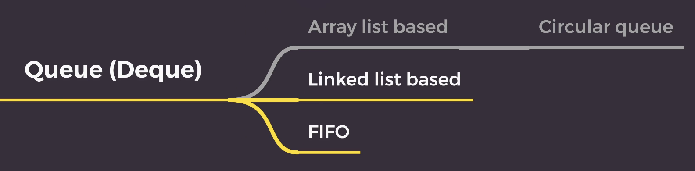

### 1. Queue



- 큐: 시간 순서상 먼저 저장한 데이터가 먼저 출력되는 선입선출(FIFO: First In First Out)형식으로 데이터를 저장하는 자료구조
- queue의 rear에 데이터를 추가하는 것을 enqueue
- queue의 front에서 데이터를 꺼내는 것을 dequeue
- 연결 리스트로 구현

### 2. 구현

1. Singly Linked List

```ts
class Node {
  constructor(val = 0, next = null) {
    this.val = val;
    this.next = next;
  }
}

class Queue {
  constructor() {
    this.head = null;
    this.tail = null;
    this.size = 0;
  }

  enqueue(val) {
    // 새로운 노드 생성
    const newNode = new Node(val);

    // 큐가 비어있을 경우 head와 tail을 모두 새 노드로 설정
    // 그렇지 않으면 현재 tail의 next 속성을 새 노드로 설정하고 tail이 새 노드를 가리키도록 업데이트
    if (!this.head) {
      this.head = newNode;
      this.tail = newNode;
    } else {
      this.tail.next = newNode;
      this.tail = newNode;
    }

    this.size++;
  }

  dequeue() {
    // 큐가 비어있을 경우 null 반환
    // 그렇지 않으면 head를 큐의 두 번째 요소로 설정하고 제거된 노드의 val를 반환
    if (!this.head) {
      return null;
    }

    const removeNode = this.head;
    this.head = this.head.next;
    if (!this.head) {
      this.tail = null;
    }

    this.size--;

    return removeNode.val;
  }
  // 큐가 비어있을 경우 true 반환, 그렇지 않으면 false 반환
  isEmpty() {
    return this.size === 0;
  }
}

const Q = new Queue();
Q.enqueue(1);
Q.enqueue(2);
Q.dequeue();
console.log(Q);
```
