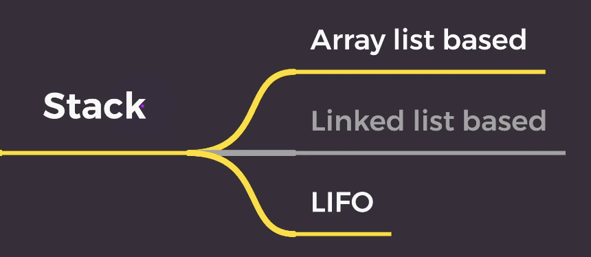

### 1. Stack



- 스택: 시간 순서상 가장 최근에 추가한 데이터가 가장 먼저 나오는 후입선출(LIFO: Last In First Out) 형식으로 데이터를 저장하는 자료구조
- stack의 top에 데이터를 추가하는 것을 push
- stack의 top에 데이터를 추출하는 것은 pop
- 배열로 구현

### 2. 코테 적용

- Stack의 다양한 활용

  > 1. LIFO 특성을 활용한 문제
  > 2. DFS(깊이 우선 탐색)에 사용

- 접근 방법

```
접근방법
1. 직관적으로 생각 -> 완탐, 단순화, 극한화 -> O(n^2) 따라서 안됨
2. 자료구조와 알고리즘 활용 -> 정렬 해볼까? -> 이 문제는 순서가 중요해서 정렬 안 됨 -> 단순화, 극한화 해보기 -> 특정한 조건에서만 반응을 함(온도가 높을때, 괄호 문제..) -> 들어오는 데이터가 다른 데이터들과 상호작용함(괄호는 1:1)
3. 메모리 사용 -> 해시테이블
```
