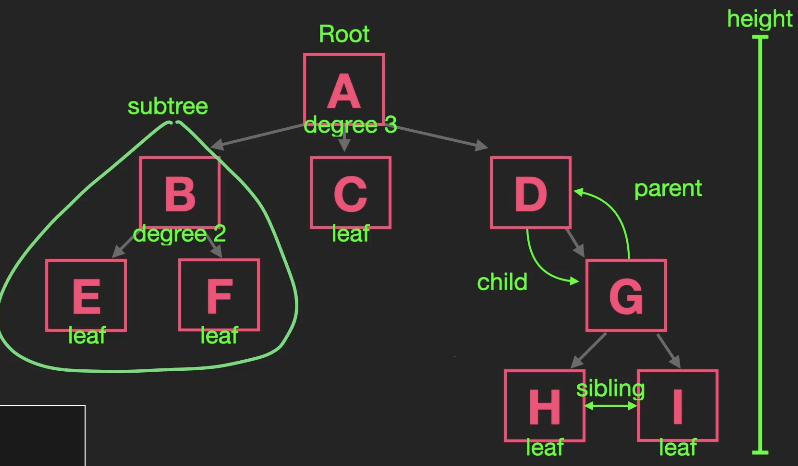
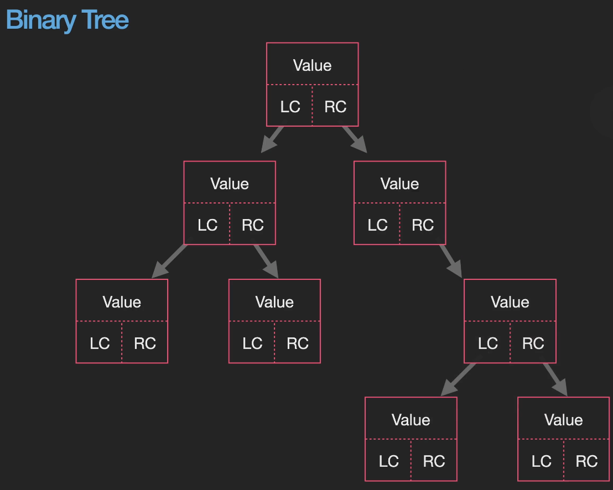
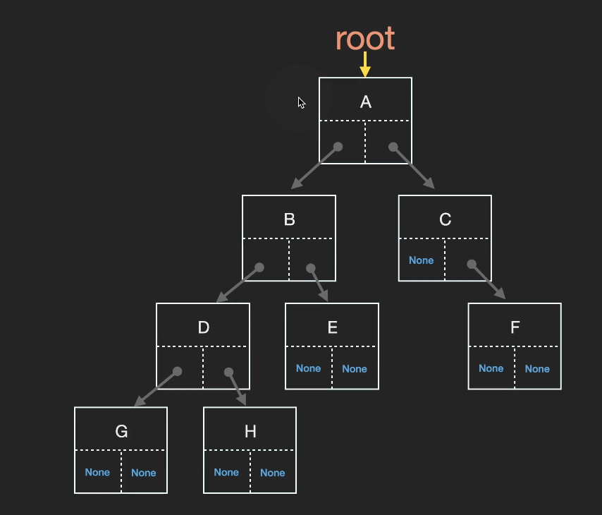

### 1. 재귀

- 재귀함수: 자신을 정의할 때 자기 자신을 재참조하는 함수를 뜻함

- 재귀함수 구성요소 2가지

1. 점화식(recurrence relation): problem과 subproblems의 관계식을 말함

2. base case

- 더 이상 재귀 호출을 하지 않아도 계산값을 반환할 수 있는 상황(조건)을 말함
- 모든 입력이 최종적으로 base case를 이용해서 문제를 해결할 수 있어야 함
- basecase가 무조건 있어야 재귀함수의 무한루프를 방지할 수 있음

- 재귀함수 전체 시간복잡도 = 재귀 함수 호출 수 \* (재귀 함수 하나당) 시간복잡도 <br>
  ex) O(n): n에 비례한 호출 -> f(n) = f(n-1) + n<br>
  ex) O(2^n): 2^n에 비례한 호출 -> f(n) = f(n-1) + f(n-2)<br>
  ex) O(3^n) = 3^n -> f(n) = f(n-1) + f(n-2) + f(n-3)<br>
  ex) O(log2n): Binary Search

### 2. 트리

- Tree: 서로 연결 된 Node의 계층형 자료구조로써, root와 부모-자식 관계의 subtree로 구성

- Tree 관련 개념



이 트리는 3진 트리

1. 노드(Node): 트리는 보통 노드로 구현
2. 간선(Edge): 노드간에 연결된 선
3. 루트 노드(Root): 트리는 항상 루트에서 시작
4. 리프 노드(Leaf): 더이상 뻗어나갈 수 없는 마지막 노드
5. 자식 노드(Child),부모노드(Parent), 형제노드(Sibling)
6. 차수(degree): 각 노드가 갖는 자식의 수, 모든 노드의 차수가 n개 이하인 트리를 n진 트리라고 함
7. 조상(ancestor): 위쪽으로 간선을 따라가면 만나는 모든 노드
8. 자손(descendant): 아래쪽으로 간선을 따라가면 만나는 모든 노드
9. 레벨(Level): 루트 노드에서 얼마나 떨어져 있는지, 루트:0
10. 높이(height): 루트노드에서 가장 멀리 있는 리프 노드까지의 거리, 즉, 리프 노드 중에 최대 레벨 값
11. 서브트리(subtree): 트리의 어떤 노드를 루트로하고, 그 자손으로 구성된 트리를 subtree라 함

- 이진 트리(Binary Tree)



1. 노드

```ts
class Node {
  constructor(val = 0, left_child = null, right_child = null) {
    this.val = val;
    this.left_child = left_child;
    this.right_child = right_child;
  }
}
```

2. 트리

```ts
class BinaryTree {
  constructor(root = null) {
    this.root = root;
  }
}

const bt = new BinaryTree();
bt.root = new Node(1);
bt.root.left = new Node(2);
bt.root.right = new Node(3);
bt.root.left.left = new Node(4);
bt.root.left.right = new Node(5);
bt.root.right.right = new Node(6);
console.log(bt);
```

### 3. 코테 적용

- Tree 활용
  > 1. Tree 구현
  > 2. Tree 순회: level order(bfs), postorder(dfs)

### 4. 레벨 순회 (Level order)

- 트리 순회 (Tree Traversal), 트리 탐색(search)라고도 불리우며 트리의 각 노드를 방문하는 과정을 말함
- 모든 노드를 한 번씩 방문 해야 하므로 완전 탐색이라고도 불림
- 순회 방법으로는 BFS, DFS가 있다.

- BFS 레벨 순회 템플릿

```ts
function bfs(root){
	const visit = []
	if(root === null){
		return 0;
	}
	const q = [root]
	while(q.length){
		const cur = q.shift()
		visit.push(cur.value)
		if(cur.left){
			q.push(cur.left)
		}
		if(cur.right){
			q.push(cur.right)
		}
	}
	return visit;
```

### 5. 전위 순회(preorder), 중위 순회(inorder), 후위 순회(postorder)



- 전위 순회: A, B, D, G, H, E, C, F
- 중위 순회: G, D, H, B, E, A, C, F
- 후위 순회: G, H, D, E, B, F, C, A

1. preorder 템플릿

- 전위 순회: 자식한테 가기 전에 먼저 자기 자신 방문
- 자기 자신 -> left child -> right child

```ts
function preorder(cur_node) {
  if (cur_node === null) {
    return;
  }
  // 방문 처리 -> 여기서는 console
  console.log(cur_node.value); // root, left, right
  preorder(cur_node.left);
  preorder(cur_node.right);
}

preorder(root);
```

2. inorder 템플릿

- 중위 순회: left부터 다 방문
- left child -> 자기 자신 -> right child

```ts
function inorder(cur_node) {
  if (cur_node === null) {
    return;
  }
  inorder(cur_node.left);
  console.log(cur_node.value); // left, root, right
  inorder(cur_node.right);
}

inorder(root);
```

3. postorder 템플릿

- 후위 순회: 자식 다 방문하고 자기 자신
- left child -> right child -> 자기 자신

```ts
function postorder(cur_node) {
  if (cur_node === null) {
    return;
  }
  postorder(cur_node.left);
  postorder(cur_node.right);
  console.log(cur_node.value); // left, right, root
}

postorder(root);
```
